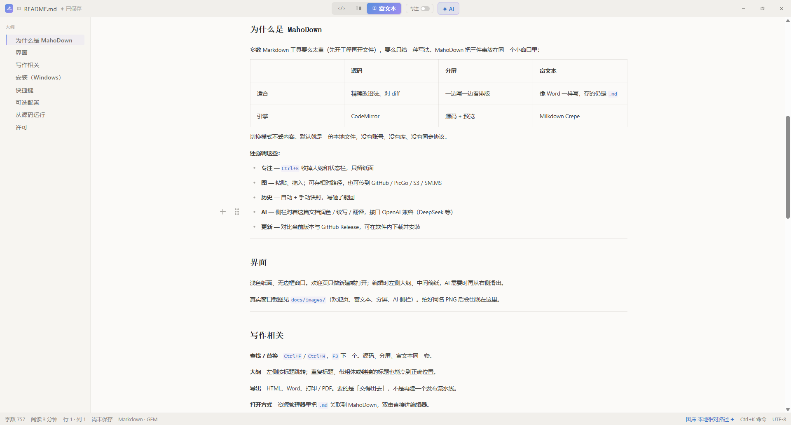
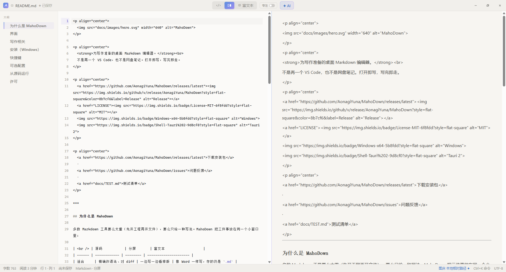
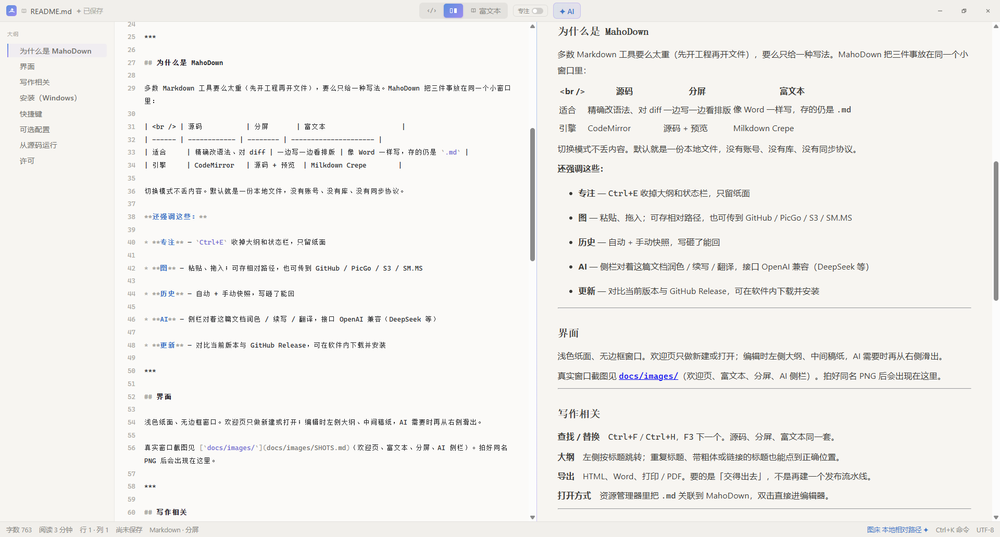
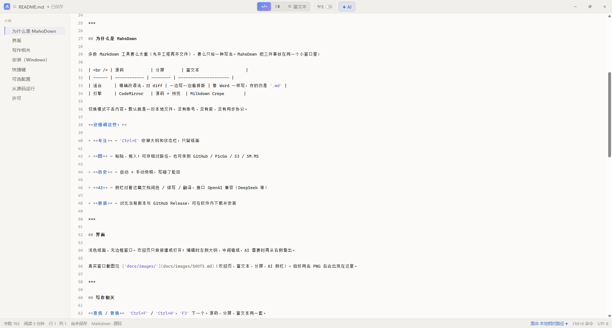
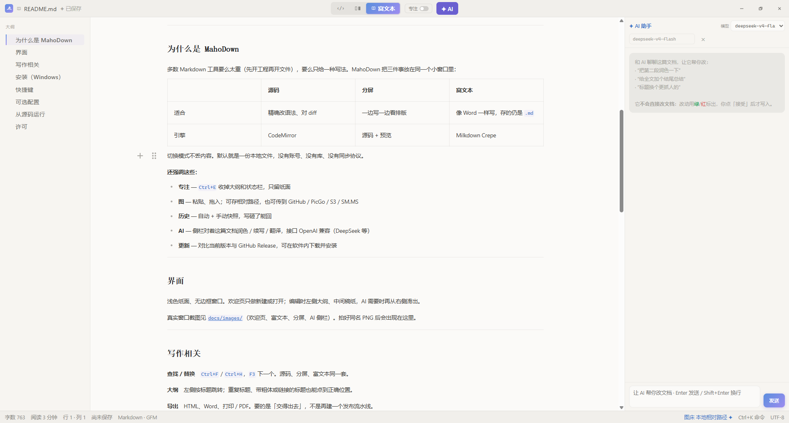
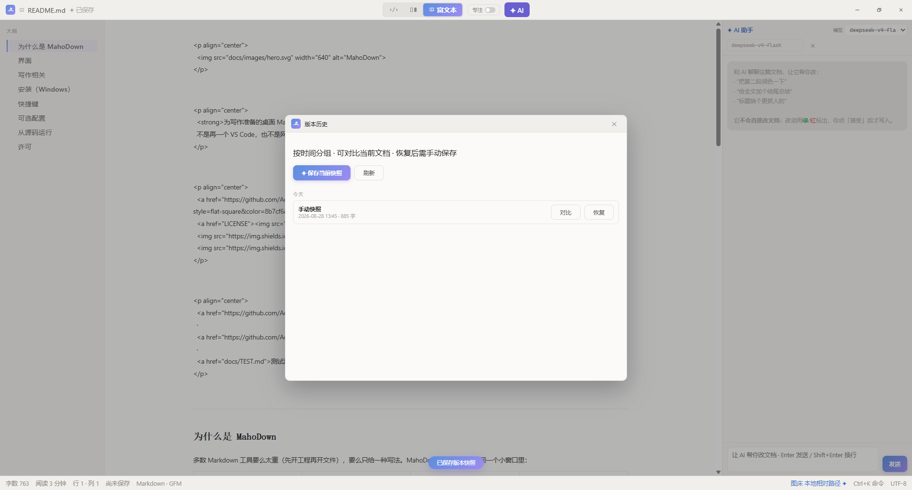

<p align="center">
  
</p>

<h1 align="center">MahoDown</h1>

<p align="center">
  <strong>为写作准备的桌面 Markdown 编辑器。</strong><br>
  不是再一个 VS Code，也不是网盘笔记。打开即写，写完即走。
</p>

<p align="center">
  <a href="https://github.com/AonagiYuna/MahoDown/releases/latest">下载安装包</a>
  ·
  <a href="https://github.com/AonagiYuna/MahoDown/issues">问题反馈</a>
  ·
  <a href="docs/TEST.md">测试清单</a>
</p>

<p align="center">
  
  
  
  
</p>

---

## 为什么是 MahoDown

多数 Markdown 工具要么太重（先开工程再开文件），要么只给一种写法。MahoDown 把三件事放在同一个小窗口里：

| 对比 | 源码 | 分屏 | 富文本 |
|------|------|------|--------|
| 适合 | 精确改语法、对 diff | 一边写一边看排版 | 像 Word 一样写，存的仍是 `.md` |
| 引擎 | CodeMirror | 源码 + 预览 | Milkdown Crepe |

切换模式不丢内容。默认就是一份本地文件，没有账号、没有库、没有同步协议。

还强调这些：

- **专注** — `Ctrl+E` 收掉大纲和状态栏，只留纸面
- **图** — 粘贴、拖入；可存相对路径，也可传到 GitHub / PicGo / S3 / SM.MS
- **历史** — 自动 + 手动快照，写砸了能回
- **AI** — 侧栏对着这篇文档润色 / 续写 / 翻译，接口 OpenAI 兼容（DeepSeek 等）
- **更新** — 对比当前版本与 GitHub Release，可在软件内下载并安装

---

## 界面

欢迎页只做新建或打开。

<p align="center"></p>

富文本：大纲 + 稿纸，点标题就能跳。

<p align="center"></p>

分屏：左边源码，右边预览。

<p align="center"></p>

源码模式，给要对语法的人。

<p align="center"></p>

AI 侧栏对着当前文档说话，改完才写入。

<p align="center"></p>

版本历史按天分组，可对比、可恢复。

<p align="center"></p>

---

## 写作相关

**查找 / 替换**　`Ctrl+F` / `Ctrl+H`，`F3` 下一个。源码、分屏、富文本同一套。

**大纲**　左侧按标题跳转；重复标题、带粗体或链接的标题也能点到正确位置。

**导出**　HTML、Word、打印 / PDF。要的是「交得出去」，不是再建一个发布流水线。

**打开方式**　资源管理器里把 `.md` 关联到 MahoDown，双击直接进编辑器。

---

## 安装（Windows）

1. 打开 [Releases](https://github.com/AonagiYuna/MahoDown/releases/latest)
2. 下载 `MahoDown_*_x64-setup.exe` 安装
3. 系统一般已带 [WebView2](https://developer.microsoft.com/microsoft-edge/webview2/)（Win10/11）

之后可在软件内 **检查更新**：会显示当前版本与最新版本；有新版本可点「立即更新」。

---

## 快捷键

| 快捷键 | 作用 |
|--------|------|
| `Ctrl+N` / `O` / `S` | 新建 / 打开 / 保存 |
| `Ctrl+K` | 命令面板 |
| `Ctrl+F` / `H` | 查找 / 替换 |
| `F3` / `Shift+F3` | 下一个 / 上一个 |
| `Ctrl+E` | 专注 |
| `Ctrl+P` | 打印 |
| `Ctrl+Shift+H` | 版本历史 |
| `Ctrl+,` | 设置 |
| `Esc` | 关掉当前面板 |

---

## 可选配置

**图床**　设置 → 图片：本地相对路径，或 GitHub / PicGo / S3 / SM.MS / 自定义 API。

**AI**　设置 → AI：填 OpenAI 兼容的 Base URL、模型与 Key（例如 DeepSeek）。不填不影响写作。

---

## 从源码运行

需要 Node.js、Rust（rustup）。

```bash
npm install
npm run dev
```

打包：

```bash
npm run build
```

安装包在 `src-tauri/target/release/bundle/`。发布时打 GitHub Release 标签 `vX.Y.Z`，并附上 `MahoDown_*_x64-setup.exe`，软件内更新才能发现新版本。

手工验收见 [测试清单](docs/TEST.md)。

---

## 许可

[MIT](LICENSE)
